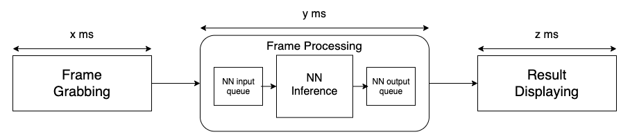
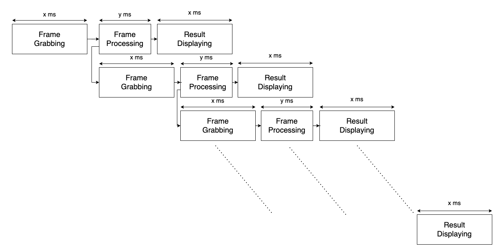
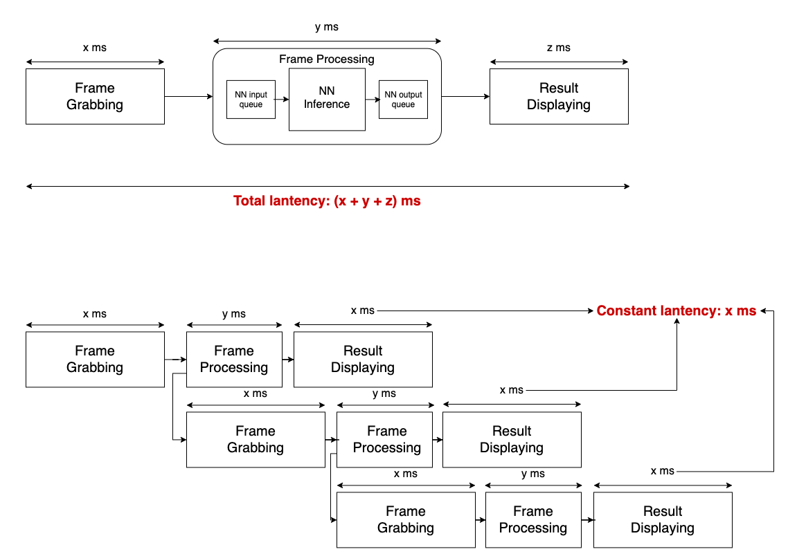
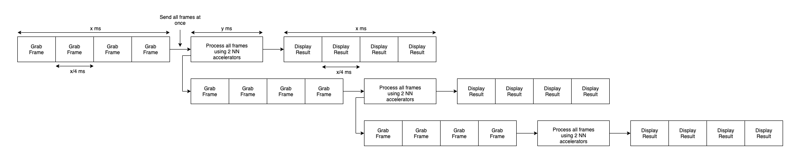

# inference_helper

When we perform inference with an OAK-D camera, the most efficient way is to set up everything into a DepthAI pipeline. This can minimize data transfers between the device and host and obtain the best inference speed from the 2 built in NCEs. However, occasionally it is not possible to set up everything in a pipeline. For example: customized image preprocessing, multi-stage NN inference with result processing in-between stages. In such cases, the typical usage of the DepthAI pipeline becomes a manual process and is demonstrated in the diagram below. 



From the diagram above, we can calculate the total latency of one frame is ```(x + y + z) ms```. This is a sequential process with some I/O tasks mix with computational tasks, and there is clearly room for improvement. By designing a packing mechanism for these three components, we can reduce the overall latency.

Also, we know that the inference time ```y``` isn't optimal in this manual process. In fact, for the same model, the inference speed in manual mode is slower than that in pipeline mode (i.e. when everything is set up into a DepthAI pipeline). We speculated that the reason for this is when we perform inference frame by frame in this way, there is only 1 NN accelerator being used all the time. Therefore we are only utilizing 50% of OAK-D's neural inference capability. If we can pass in multiple frames to the NN node simultaneously, we can use all NN accelerators. 

With these two goals in mind, we derived the following packing mechanism:



The key is to introduce a short delay by locking the frame rate to the slowest component in the inference process and making sure both the frame-grabbing component and result displaying component can finish in the same amount of time. With this structure, the total latency of this process is only the time it takes for the slowest component to complete. The diagram below shows the comparison in inference time between this packing mechanism to the sequential mechanism.



Furthermore, with the packing mechanism, we can use it to grab and infer an arbitrary number of frames simultaneously, which helps to utilize the 2 NN accelerators in the OAK-D camera. The diagram below demonstrates this process.



## Testing results

Using [this example](https://docs.luxonis.com/projects/api/en/latest/samples/video_mobilenet/) as baseline, we compared the average FPS before and after using our packing mechanism. The original script of this example is mostly unchanged except:
1. A resize step is added after reading in the video frame.
2. A time measurement is added to get the overall FPS.
You can find this script in the project's root folder with name ```video_mobilenet.py```

This comparison was run on a Raspberry Pi 4 and a Macbook Pro 16' with a 2.3 GHz 8-Core Intel Core i9 processor. The results are presented in the table below.

|  | Before packing | 1 frame | 2 frames | 4 frames |
|:--:|:--:|:--:|:--:|:--:|
| Raspberry Pi 4 | 12 FPS | 17 FPS | 20 FPS | 20 FPS |
| Macbook pro 16'| 17 FPS | 24 FPS | 26 FPS | 25 FPS |

## Usage

```python
from inference_helper import InferenceHelper

def preprocess_func(frame):
    # implement your own preprocesssing function

def postprocess_func(raw_nn_results):
    # implement your own post-processsing function

def display_func(frame, nn_results):
    # implement your own result display function

if __name__ == '__main__':
    my_inference_helper = InferenceHelper(
        video_path, # Put in your video location
        preprocess_func,
        nn_path, # Put in your nn model path
        (300, 300), # Check your nn input size
        2, # Number of frame to grab and inference in each time
        postprocess_func,
        display_func,
        lock_fps=27, # The frame rate you want the grabbing and display component to run for
        is_mobilenetdetection_nn=True, # set True if using mobiletnet detection models
    )
    my_inference_helper.run()

```

An example is provided in the project's root folder with name ```demo.py```

## Notes

This is just a proof of concept project, please feel free to contribute to this project to make it more applicable to different use cases. Some idea that you can expand on:

1. Support OAK-D RGB and Mono camera as input source
2. Support OAK-D stereo as input source
3. Support multi-stage NN models in the processing component
4. Support automatic framerate optimization

